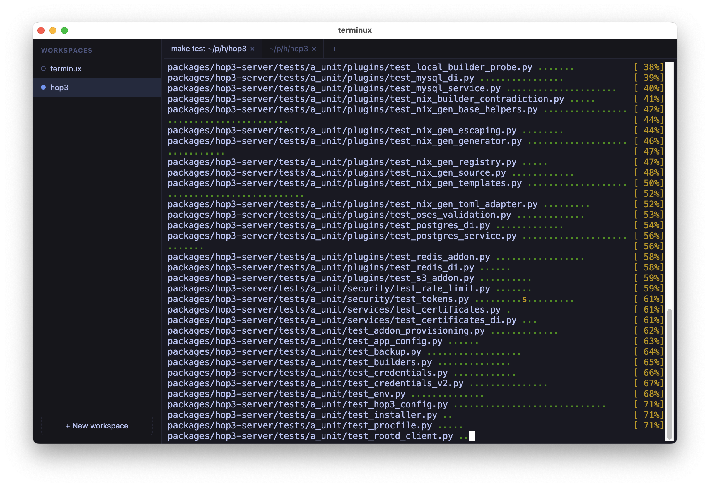
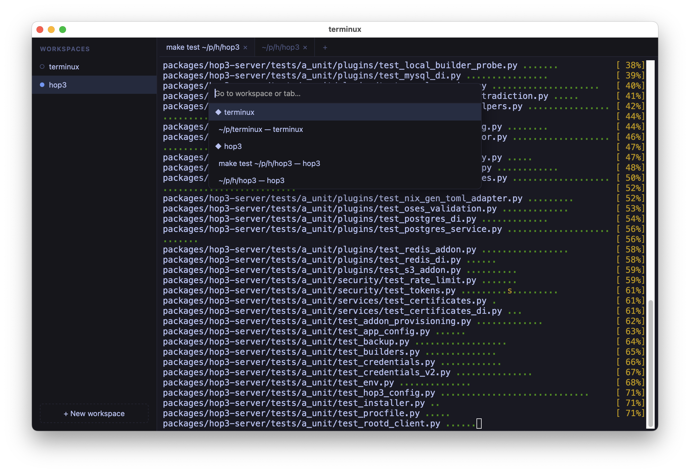

<div align="center">

# terminux

### A fast, reliable, cross-platform terminal — organized the way you actually work.

**Workspaces on the left. Tabbed terminals in the middle. Everything where you left it.**

[](https://www.python.org/downloads/)
[](#-install--package)
[](#-status--v1-preview)
[](https://github.com/abilian/terminux)

<br/>



</div>

---

## Why terminux?

You don't have one project. You have *six*. Each one is a different directory, a
different mental context, a different set of running shells. terminux gives each
of them a home — a **workspace** — and keeps them alive and arranged exactly how
you left them, even across restarts.

It's the workspace UX of [cmux](https://github.com/) on a clean, auditable
two-process architecture inspired by terax — rebuilt in **Python** for
**reliability over features**. No accounts. No telemetry. No AI. Just a terminal
that respects your flow.

```sh
uv sync && make frontend
uv run terminux
```

That's it. You're in.

## ✨ What you get

- **Workspaces sidebar** — a persistent list of named workspaces. Names track
  the active shell's working directory automatically (until you pin one).
- **Tabbed terminals** — every workspace has its own tabs, each a real PTY
  shell. Switch freely; background tabs keep streaming, no jank.
- **Survives restarts** — workspaces, tabs, window geometry, font size, each
  shell's working directory, and *the visible scrollback of every tab* all
  come back. Fresh shells, same layout, same view you left.
- **Keyboard-first** — sidebar shows a keycap on each of the first nine
  workspaces; jump straight there with `Ctrl+Shift+1..9` on Linux
  (`Cmd+1..9` on macOS). Plus a fuzzy quick-switcher, find-in-terminal,
  font zoom, and more.
- **Platform-respecting shortcuts** — Linux uses `Ctrl+Shift+<key>` for app
  shortcuts (matching GNOME Terminal, Konsole, Alacritty, Ghostty, kitty),
  so raw `Ctrl+P` / `Ctrl+B` / `Ctrl+F` flow straight to your shell. macOS
  uses `Cmd` for the same job; raw `Ctrl` is left alone.
- **Clickable URLs & iTerm2-style copy** — modifier-click opens links;
  optional auto-copy on selection, persisted, off by default.
- **Working vs ready** — sidebar status dot turns amber while a
  workspace is running a foreground task; green wins for unseen output;
  reads at a glance like a CI traffic light.
- **Attention that finds you** — background activity indicators; a real
  BEL, `OSC 9`, or a long-running command finishing (`OSC 133;D`, opt-in
  via [shell integration](docs/shell-integration.md) for bash / zsh /
  fish) on an off-screen tab raises a badge that bubbles up to its
  workspace. Title-bar updates don't count.
- **Drag & drop** — reorder workspaces and tabs with live drop feedback
  (works even in WKWebView, where HTML5 DnD doesn't). Drop a file to paste its
  shell-quoted path.
- **Local-first & hardened** — loopback-only by default, per-session auth
  token, CSP and security headers, atomic versioned persistence.

<div align="center">



<sub>The fuzzy quick switcher (<code>Ctrl+Shift+P</code> on Linux, <code>Cmd+P</code> on macOS) — jump to any workspace or tab.</sub>

</div>

## Run

```sh
uv sync
make frontend                # build the web UI (needs Node; first run only)
uv run terminux              # desktop window (pywebview)
uv run terminux --no-window  # server only — open the printed URL in a browser
```

`--no-window` is the dev/test path and a preview of the future **web mode**.

## Install / package

terminux ships as a self-contained desktop app — no Python or Node required to
run the bundle.

```sh
make linux        # Linux bundle (built in Docker) → dist/linux/terminux/terminux
make docker-run   # run headless web mode on :8000
make app          # macOS .app → dist/terminux.app
```

Full platform notes (signing, Gatekeeper, X11, architectures) live in the
[**documentation**](#-documentation).

## Documentation

Docs are built with [Zensical](https://zensical.org/) and live in `docs/`.

```sh
uv run zensical serve    # live preview at http://127.0.0.1:8000
uv run zensical build    # static site → site/
```

Start with [`docs/index.md`](docs/index.md). The original vision, functional
spec, and technical spec are in [`notes/`](notes/).

## Develop

```sh
make frontend        # build TS/Vite UI → src/terminux/web/static
make frontend-test   # vitest unit tests (pure TS logic)
make test            # pytest: unit, integration, e2e (Playwright)
make lint            # ruff + ty + pyrefly + mypy
make format
```

The e2e tier drives the served UI with a real browser (no pywebview); install
it once with `uv run playwright install chromium`.

## Status — 0.5 preview

**Works today:** workspaces sidebar (create / rename / reorder / close, auto
status dot), tabs with multiple live terminals, real PTY shells over a
per-terminal WebSocket, background streaming, structure persisted to disk
(fresh shells on restart), per-session loopback token, macOS & Linux bundles.

**Not yet:** split panes, client/server detach, Windows PTY.

## Architecture in one breath

A Vite/TypeScript xterm.js web UI runs in a sandboxed pywebview window and talks
to a loopback Starlette/uvicorn backend that owns the PTYs and streams raw bytes
over per-terminal WebSockets. The frontend build output is committed to
`src/terminux/web/static/`, so the Python package runs with no Node toolchain.

<div align="center">
<sub>Built for people who keep too many terminals open. — <a href="https://github.com/abilian/terminux">abilian/terminux</a></sub>
</div>
