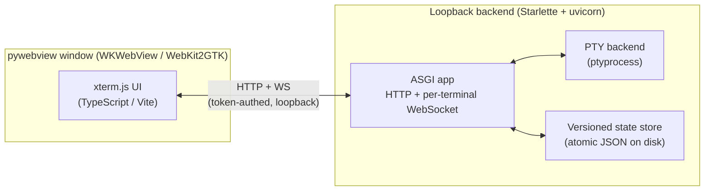

# Architecture

terminux follows a **two-process design**: a sandboxed web UI
that renders terminals, and a backend that owns the PTYs and streams raw bytes
over a narrow, typed channel.

## The two processes

- **Frontend** — a Vite/TypeScript app built on **xterm.js**, rendered inside a
  sandboxed [pywebview](https://pywebview.flowrl.com/) window. The build output
  is committed to `src/terminux/web/static/`, so the Python package runs with no
  Node toolchain.
- **Backend** — a loopback **Starlette/uvicorn** ASGI server. It owns the PTYs
  (via `ptyprocess`), serves the static UI, and exposes a **per-terminal
  WebSocket** that streams raw PTY bytes.

The same backend runs headless in *web mode* (`--host` / `--no-window`), which
is also the dev/test path.

## Source layout

| Path | Responsibility |
| --- | --- |
| `src/terminux/app.py` | Entry point; wires the window + server together. |
| `src/terminux/server/asgi.py` | ASGI app: HTTP routes + WebSocket handler. |
| `src/terminux/server/auth.py` | Per-session loopback token. |
| `src/terminux/core/model.py` | Workspace / tab / terminal data model. |
| `src/terminux/core/persistence.py` | Atomic, versioned on-disk state. |
| `src/terminux/core/terminal.py` | Terminal session lifecycle. |
| `src/terminux/core/pty_backend.py` | PTY spawning and I/O (`ptyprocess`). |
| `src/terminux/core/shellprobe.py` | Shell / working-directory probing. |
| `src/terminux/web/static/` | Committed frontend build output. |

## Key design decisions

- **Raw-byte streaming with backpressure.** Terminal output uses a bounded
  per-subscriber buffer with coalesced flushing and an explicit drop notice. PTY
  spawning is serialized.
- **Structure-only persistence.** Only the layout is saved — live processes and
  scrollback are not. State is written atomically and versioned, so a port or
  version change doesn't lose your workspaces.
- **Loopback + token by default.** HTTP responses carry a strict CSP and
  security headers; a per-session token authenticates every request and
  WebSocket. Binding beyond loopback (`--host 0.0.0.0`) makes the token the only
  line of defense — keep the URL private.
- **Reliability over features.** Small, auditable surface; no editor, AI, git,
  or file navigator. The data model leaves the door open to split panes without
  committing to them in v1.

For the full rationale, see `notes/vision.md`, `notes/functional-spec.md`, and
`notes/technical-spec.md`.
